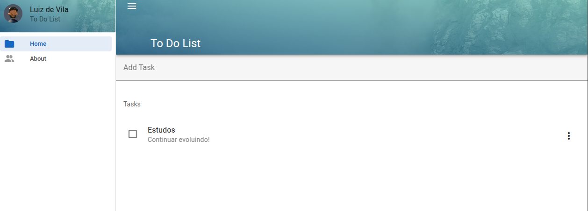

# 📚 Curso de Vue 3 com Vuetify e Pinia

📌 Descrição

Este projeto foi desenvolvido durante o curso disponível na plataforma de ensino Udemy ministrado por Yuri Marcon e utilizando Vue.js, Vuetify e Pinia para criar uma interface moderna, responsiva e com um gerenciamento de estado eficiente.

🚀 Tecnologias Utilizadas

🟢 Vue.js (Framework)

Vue.js é um framework progressivo para construção de interfaces de usuário. Ele é focado na camada de visualização e pode ser facilmente integrado a outros projetos ou utilizado para desenvolver Single Page Applications (SPAs).

🎨 Vuetify (Biblioteca de UI)

Vuetify é uma biblioteca de componentes baseada no Material Design do Google. Com ele, é possível criar interfaces responsivas e elegantes sem a necessidade de estilização manual.

📦 Pinia (Gerenciador de Estado)

Pinia é um gerenciador de estado moderno para Vue.js, sendo uma alternativa mais simples e intuitiva ao Vuex. Ele permite centralizar e compartilhar estados entre componentes de forma eficiente.



## Project setup

```
# yarn
yarn

# npm
npm install

# pnpm
pnpm install

# bun
bun install
```

### Compiles and hot-reloads for development

```
# yarn
yarn dev

# npm
npm run dev

# pnpm
pnpm dev

# bun
bun run dev
```

### Compiles and minifies for production

```
# yarn
yarn build

# npm
npm run build

# pnpm
pnpm build

# bun
bun run build
```
